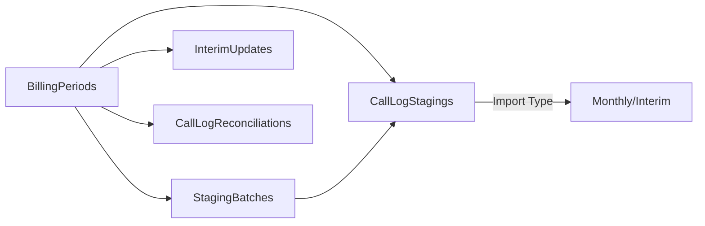

# BillingPeriods Table Usage Guide

## Table Overview
The `BillingPeriods` table is a core component of the telecom billing system that manages monthly billing cycles and interim updates for call log processing.

## Current Implementation Status
**PARTIALLY IMPLEMENTED** - The table is defined in the model and database context but not fully integrated into the application workflow.

## Table Structure

```sql
BillingPeriods
├── Id (PK)
├── PeriodCode (Unique) - Format: "2024-09"
├── StartDate / EndDate - Billing cycle boundaries
├── Status - OPEN, PROCESSING, CLOSED, LOCKED
├── Monthly Billing Fields
│   ├── MonthlyImportDate
│   ├── MonthlyBatchId
│   ├── MonthlyRecordCount
│   └── MonthlyTotalCost
├── Interim Updates Fields
│   ├── InterimUpdateCount
│   ├── LastInterimDate
│   ├── InterimRecordCount
│   └── InterimAdjustmentAmount
└── Closure/Audit Fields
    ├── ClosedDate / ClosedBy
    ├── LockedDate / LockedBy
    └── CreatedDate / CreatedBy / Notes
```

## How It's Used in the Application

### 1. **Billing Cycle Management**
The table tracks distinct billing periods (typically monthly) with four status levels:
- **OPEN** - Accepting new call records and modifications
- **PROCESSING** - Being verified and consolidated
- **CLOSED** - Finalized but can be reopened with approval
- **LOCKED** - No changes allowed without CFO approval

### 2. **Data Relationships**



### 3. **Key Relationships**

#### With StagingBatches
- Each staging batch is associated with a billing period
- Multiple batches can exist per period (monthly + interim updates)
- Foreign Key: `StagingBatches.BillingPeriodId`

#### With CallLogStaging
- Each staged call log is linked to a billing period
- Tracks whether it's a monthly or interim import
- Foreign Key: `CallLogStagings.BillingPeriodId`

#### With InterimUpdates
- Tracks all mid-cycle adjustments and corrections
- Requires approval workflow for closed periods
- Foreign Key: `InterimUpdates.BillingPeriodId`

#### With CallLogReconciliations
- Maintains version history of call records
- Tracks changes between monthly and interim imports
- Foreign Key: `CallLogReconciliations.BillingPeriodId`

### 4. **Business Logic Implementation**

#### Period Status Control
```csharp
// From BillingPeriod.cs model
public bool CanImportMonthly()
{
    return Status == "OPEN" && MonthlyBatchId == null;
}

public bool CanAcceptInterim()
{
    return Status == "OPEN" || Status == "PROCESSING";
}

public bool RequiresApprovalForChanges()
{
    return Status == "CLOSED" || Status == "LOCKED";
}
```

#### Statistics Tracking
The model automatically updates statistics when staging records are processed:
- Monthly vs Interim record counts
- Total costs and adjustments
- Last update timestamps

### 5. **Workflow Process**

```
1. Create Period → Status: OPEN
   ↓
2. Import Monthly Data → MonthlyBatchId set
   ↓
3. Process & Verify → Status: PROCESSING
   ↓
4. Accept Interim Updates (if needed)
   ↓
5. Close Period → Status: CLOSED
   ↓
6. Lock Period (optional) → Status: LOCKED
```

### 6. **Current Usage Gaps**

#### Not Fully Implemented:
1. **Automatic Period Creation** - Periods need to be manually created
2. **UI for Period Management** - No admin page for managing billing periods
3. **Integration with Staging** - CallLogStagingService doesn't create/check periods
4. **Approval Workflow** - InterimUpdates approval process not implemented
5. **Reconciliation Reports** - CallLogReconciliation not actively used

#### Where It Should Be Used:
1. **CallLogStagingService.ConsolidateCallLogsAsync()**
   - Should create/find billing period before creating batch
   - Should set BillingPeriodId on staging batches

2. **Admin Pages**
   - Need UI for viewing/managing billing periods
   - Dashboard showing period status and statistics

3. **Import Process**
   - Should validate period status before allowing imports
   - Should update period statistics after import

### 7. **Intended Benefits**

1. **Financial Control**
   - Clear monthly cutoffs for billing
   - Audit trail for all adjustments

2. **Data Integrity**
   - Prevents duplicate charges
   - Tracks all versions of call records

3. **Compliance**
   - Approval workflow for closed periods
   - Complete history of changes

4. **Reporting**
   - Monthly vs interim comparisons
   - Adjustment tracking and justification

### 8. **Implementation Recommendations**

#### Short-term:
1. Create admin page for BillingPeriod management
2. Integrate period creation in staging workflow
3. Add period validation to import process

#### Medium-term:
1. Implement approval workflow for interim updates
2. Add reconciliation reporting
3. Create automated period creation job

#### Long-term:
1. Implement full versioning with CallLogReconciliation
2. Add financial reporting dashboards
3. Integrate with external billing systems

## Example Usage Scenarios

### Scenario 1: Monthly Import
```
September 2024 billing:
1. System creates period "2024-09" (OPEN)
2. On Oct 5th, import September call logs
3. Verify and process (PROCESSING)
4. Close period on Oct 10th (CLOSED)
```

### Scenario 2: Interim Adjustment
```
Disputed charge from September:
1. Period "2024-09" is CLOSED
2. Create InterimUpdate request with justification
3. Get approval from supervisor
4. Import correction records (marked as INTERIM)
5. System tracks adjustment amount
```

### Scenario 3: Staff Separation
```
Staff leaving mid-month:
1. Current period is OPEN
2. Import interim bill for specific staff member
3. Mark as staff separation in StagingBatch
4. Process without affecting monthly totals
```

## Database Queries

### Find Current Period
```sql
SELECT TOP 1 * FROM BillingPeriods
WHERE Status IN ('OPEN', 'PROCESSING')
ORDER BY StartDate DESC
```

### Get Period Statistics
```sql
SELECT
    PeriodCode,
    Status,
    MonthlyRecordCount + InterimRecordCount as TotalRecords,
    MonthlyTotalCost + InterimAdjustmentAmount as TotalAmount,
    InterimUpdateCount
FROM BillingPeriods
WHERE PeriodCode = '2024-09'
```

### Check for Unprocessed Periods
```sql
SELECT * FROM BillingPeriods
WHERE Status = 'OPEN'
AND MonthlyBatchId IS NOT NULL
AND DATEDIFF(day, EndDate, GETDATE()) > 10
```

## Summary
The BillingPeriods table provides a robust framework for managing telecom billing cycles with support for both regular monthly processing and interim adjustments. While the infrastructure is in place, full implementation requires integration with the staging workflow and creation of management interfaces.