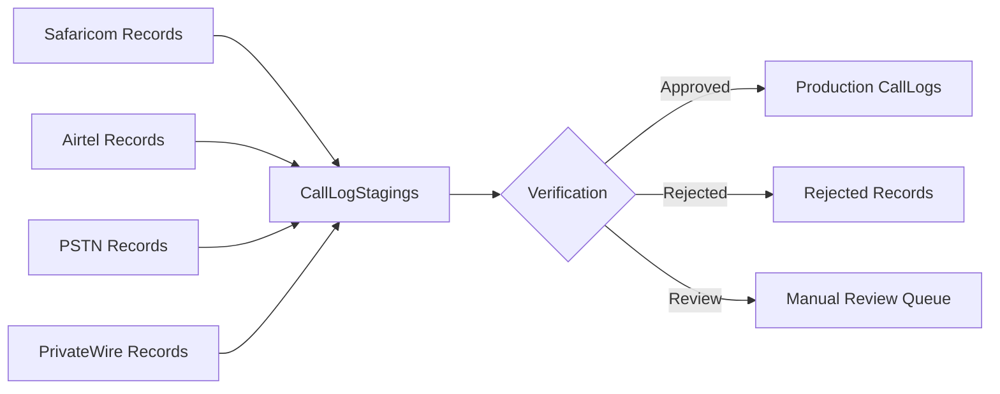

# CallLogStagings Table Usage Documentation

## Table Purpose
The `CallLogStagings` table serves as a **centralized staging area** for consolidating, verifying, and processing telecom call records from multiple service providers before they enter production.

## Core Function: ETL Pipeline Hub



## How It Works in the Application

### 1. **Data Consolidation Process**
The staging table acts as a unified format for heterogeneous telecom data:

#### Import Flow (CallLogStagingService)
```csharp
// From 4 source tables with different schemas:
Safaricom → CallLogStaging (standardized)
Airtel → CallLogStaging (standardized)
PSTN → CallLogStaging (standardized)
PrivateWire → CallLogStaging (standardized)
```

Key transformations during import:
- **Currency normalization** - Converts all costs to USD and KSH
- **Duration standardization** - Converts minutes to seconds
- **Phone number matching** - Links to UserPhones table
- **User assignment** - Maps to responsible IndexNumber

### 2. **Staging Batch Management**

Each import creates a **StagingBatch** that groups related records:
- Batch ID links all records from one import session
- Tracks statistics (total, verified, rejected, anomalies)
- Manages workflow status (Created → Processing → Verified → Published)

### 3. **Data Quality & Anomaly Detection**

The system automatically detects issues during staging:

```
Anomaly Types Detected:
├── NO_USER - Extension not linked to user
├── NO_PHONE - Phone number not registered
├── INACTIVE_USER - User is deactivated
├── HIGH_COST - Call exceeds $100
├── FUTURE_DATE - Call date in future
├── EXCESSIVE_DURATION - Call > 4 hours
├── WEEKEND_CALL - Unusual weekend activity
└── DUPLICATE - Potential duplicate record
```

### 4. **Verification Workflow**

```
Status Flow:
Pending → [Manual Review] → Verified/Rejected
         ↓
    RequiresReview → [Supervisor Check] → Verified/Rejected
```

### 5. **Key Table Fields & Their Usage**

| Field | Purpose | Usage in App |
|-------|---------|--------------|
| **ExtensionNumber** | Source phone/extension | Links to UserPhones table |
| **ResponsibleIndexNumber** | Staff responsible for call | Links to EbillUsers |
| **PayingIndexNumber** | Who pays for the call | For split billing scenarios |
| **UserPhoneId** | Direct link to phone record | Tracks which device made call |
| **BillingPeriodId** | Billing cycle reference | Groups by monthly periods |
| **BatchId** | Import batch reference | Groups related imports |
| **VerificationStatus** | Approval state | Controls workflow |
| **ProcessingStatus** | ETL pipeline state | Tracks processing |
| **HasAnomalies** | Quality flag | Triggers review |
| **SourceSystem** | Origin provider | Safaricom/Airtel/PSTN/PrivateWire |
| **ImportType** | MONTHLY or INTERIM | Distinguishes regular vs corrections |

### 6. **Relationships**

```
CallLogStagings connects to:
├── StagingBatch (via BatchId)
├── EbillUsers (via ResponsibleIndexNumber & PayingIndexNumber)
├── UserPhones (via UserPhoneId)
├── BillingPeriods (via BillingPeriodId)
└── AnomalyTypes (via AnomalyTypes JSON field)
```

## Application Integration Points

### 1. **Admin UI (CallLogStaging.cshtml)**
- View staged records with filters
- Bulk verification actions
- Anomaly review interface
- Batch management

### 2. **CallLogStagingService**
Primary service handling:
- **ConsolidateCallLogsAsync()** - Main import orchestrator
- **ImportFrom[Provider]Async()** - Provider-specific imports
- **DetectBatchAnomaliesAsync()** - Quality checks
- **VerifyBatchAsync()** - Bulk approval
- **PublishToProductionAsync()** - Final migration

### 3. **Processing States**

```
ProcessingStatus enum:
├── Staged - Initial import complete
├── Processing - Under verification
├── Completed - Moved to production
└── Failed - Error occurred
```

```
VerificationStatus enum:
├── Pending - Awaiting review
├── Verified - Approved for production
├── Rejected - Will not be processed
└── RequiresReview - Needs supervisor check
```

## Workflow Example

### Monthly Consolidation Process:

1. **Trigger Consolidation** (Admin UI)
   ```
   Date Range: Sept 1-30, 2024
   ```

2. **Service Creates Batch**
   ```csharp
   BatchId: {GUID}
   BatchName: "Call Logs September 2024"
   Status: Created
   ```

3. **Import from Sources**
   ```
   Safaricom: 1,250 records → Staging
   Airtel: 830 records → Staging
   PSTN: 420 records → Staging
   PrivateWire: 95 records → Staging
   Total: 2,595 records
   ```

4. **Anomaly Detection**
   ```
   15 records: NO_USER
   3 records: HIGH_COST
   1 record: FUTURE_DATE
   Batch.RecordsWithAnomalies = 19
   ```

5. **Admin Review**
   - Views flagged records
   - Manually verifies high-cost calls
   - Rejects future-dated record
   - Approves remaining

6. **Publish to Production**
   ```
   2,594 records → CallLogs table
   1 record → Rejected (logged)
   Batch.Status = Published
   ```

## Key Benefits

1. **Data Quality Control**
   - Catches errors before production
   - Standardizes heterogeneous data
   - Maintains audit trail

2. **Flexible Verification**
   - Bulk operations for efficiency
   - Individual review for exceptions
   - Configurable anomaly rules

3. **Multi-Source Support**
   - Handles different provider formats
   - Unified processing pipeline
   - Consistent output format

4. **Audit & Compliance**
   - Complete import history
   - Verification tracking
   - User accountability

## Performance Considerations

### Indexes
```sql
IX_CallLogStagings_BatchId - Fast batch queries
IX_CallLogStagings_ResponsibleIndexNumber - User lookups
IX_CallLogStagings_UserPhoneId - Phone linking
IX_CallLogStagings_BillingPeriodId - Period grouping
```

### Batch Processing
- Imports use bulk insert operations
- Anomaly detection runs asynchronously
- Verification updates in batches

## Current Implementation Status

✅ **Fully Implemented:**
- Data import from 4 providers
- Anomaly detection system
- Batch management
- Admin UI for staging
- Verification workflow

⚠️ **Partially Implemented:**
- BillingPeriod integration (table exists, not fully used)
- Interim vs Monthly distinction
- Approval hierarchies

❌ **Not Implemented:**
- Automatic publishing to production
- Email notifications
- Scheduled imports via Azure Data Factory
- Full reconciliation reporting

## SQL Queries for Common Operations

### View Current Staging Batch
```sql
SELECT TOP 1
    sb.BatchName,
    sb.BatchStatus,
    sb.TotalRecords,
    sb.RecordsWithAnomalies,
    COUNT(cls.Id) as ActualRecords
FROM StagingBatches sb
LEFT JOIN CallLogStagings cls ON cls.BatchId = sb.Id
WHERE sb.BatchStatus IN ('Created', 'Processing')
GROUP BY sb.Id, sb.BatchName, sb.BatchStatus,
         sb.TotalRecords, sb.RecordsWithAnomalies
ORDER BY sb.CreatedDate DESC
```

### Find Unverified High-Value Calls
```sql
SELECT
    cls.*,
    eu.FirstName + ' ' + eu.LastName as UserName
FROM CallLogStagings cls
LEFT JOIN EbillUsers eu ON eu.IndexNumber = cls.ResponsibleIndexNumber
WHERE cls.VerificationStatus = 'Pending'
AND cls.CallCostUSD > 50
ORDER BY cls.CallCostUSD DESC
```

### Anomaly Statistics
```sql
SELECT
    JSON_VALUE(AnomalyTypes, '$[0]') as PrimaryAnomaly,
    COUNT(*) as Count
FROM CallLogStagings
WHERE HasAnomalies = 1
AND VerificationStatus = 'Pending'
GROUP BY JSON_VALUE(AnomalyTypes, '$[0]')
ORDER BY Count DESC
```

## Summary

The CallLogStagings table is the **critical middleware** in the telecom billing system, providing:
- **Data consolidation** from multiple providers
- **Quality assurance** through anomaly detection
- **Verification workflow** for admin oversight
- **Audit trail** for compliance

It transforms raw, heterogeneous telecom data into clean, verified records ready for billing and reporting, while maintaining full traceability and control over the data pipeline.