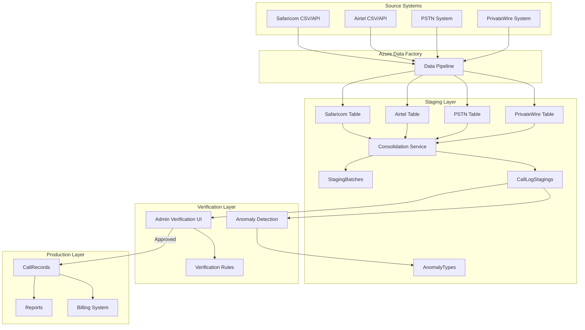

# Call Log Staging System - Entity Relationship Diagram

## Table Explanations

### Core Staging Tables

#### 1. **StagingBatches**
**Purpose**: Container for grouped call log imports
- **What it does**: Groups related call logs imported together into a single batch for processing
- **Why it exists**: Provides transaction-like capability to approve/reject sets of records together
- **Key responsibilities**:
  - Tracks batch lifecycle (Draft → Processing → Review → Published)
  - Maintains statistics (total, verified, rejected, pending records)
  - Records audit trail (who created/verified/published)
  - Enables rollback of entire import if issues found
- **Business value**: Ensures data quality by allowing review of complete datasets before production

#### 2. **CallLogStagings**
**Purpose**: Temporary holding area for unverified call records
- **What it does**: Stores consolidated call records from all providers awaiting verification
- **Why it exists**: Allows data validation and correction before impacting billing
- **Key responsibilities**:
  - Consolidates data from 4 different telecom sources
  - Tracks verification status for each record
  - Stores detected anomalies for admin review
  - Maps calls to responsible users for cost allocation
- **Business value**: Prevents billing errors by catching issues before production

#### 3. **AnomalyTypes**
**Purpose**: Reference catalog of data quality issues
- **What it does**: Defines types of problems that can occur in call logs
- **Why it exists**: Standardizes error detection and handling across the system
- **Predefined types**:
  - `NO_USER`: Extension not linked to any active user
  - `INACTIVE_USER`: Extension linked to terminated employee
  - `HIGH_COST`: Call exceeds reasonable cost threshold ($100)
  - `DUPLICATE`: Potential duplicate billing record
  - `INVALID_NUMBER`: Destination number format invalid
  - `FUTURE_DATE`: Call date is in the future
  - `EXCESSIVE_DURATION`: Call duration exceeds 8 hours
- **Business value**: Ensures consistent data quality rules

#### 4. **CallRecords** (Production)
**Purpose**: Final repository for verified, billable call logs
- **What it does**: Stores clean, approved call records used for actual billing
- **Why it exists**: Provides trusted data source for financial reporting
- **Key responsibilities**:
  - Stores only verified, anomaly-free records
  - Maintains source tracking for audit purposes
  - Provides data for monthly billing runs
  - Supports financial reporting and analysis
- **Business value**: Ensures accurate billing and reduces disputes

### Source Telecom Tables

#### 5. **Safaricom**
**Purpose**: Raw mobile call data from Safaricom provider
- **What it does**: Stores unprocessed Safaricom mobile network calls
- **Data source**: Daily CSV files or API feed from Safaricom
- **Typical records**: Mobile calls, SMS, data usage
- **Key fields**: `Ext` (extension), `Dialed` (destination), `Dur` (minutes), `Cost` (KES)
- **Volume**: ~10,000 records/day

#### 6. **Airtel**
**Purpose**: Raw mobile call data from Airtel provider
- **What it does**: Stores unprocessed Airtel mobile network calls
- **Data source**: Daily CSV files from Airtel billing system
- **Typical records**: Mobile calls, international roaming
- **Key fields**: Similar to Safaricom but with provider-specific formats
- **Volume**: ~5,000 records/day

#### 7. **PSTN** (Public Switched Telephone Network)
**Purpose**: Traditional landline/desk phone records
- **What it does**: Stores fixed-line telephone calls from office phones
- **Data source**: PBX system exports
- **Typical records**: Office-to-office calls, external landline calls
- **Key fields**: `Extension`, `CalledNumber`, `Duration` (seconds), `Cost`
- **Volume**: ~15,000 records/day

#### 8. **PrivateWire**
**Purpose**: Internal UN private network calls
- **What it does**: Stores inter-office communication within UN network
- **Data source**: Internal VOIP system
- **Typical records**: HQ to field office calls, video conferences
- **Special feature**: Often zero-cost or reduced-rate calls
- **Volume**: ~3,000 records/day

### User Management Tables

#### 9. **EbillUsers**
**Purpose**: Master directory of all staff for billing purposes
- **What it does**: Central repository of all employees who can incur telecom charges
- **Why it exists**: Maps phone extensions to responsible individuals
- **Key data**:
  - Staff identification (`IndexNumber`, name, email)
  - Contact numbers (extension, mobile, direct line)
  - Organizational assignment (organization, office, department)
  - Employment status (active/inactive)
- **Business value**: Ensures accurate cost attribution to correct person/department

#### 10. **UserPhones**
**Purpose**: Tracks multiple phone assignments per user
- **What it does**: Manages phone lifecycle and history
- **Why it exists**: Users often have multiple devices (desk phone, mobile, home)
- **Tracks**:
  - Phone assignments and returns
  - Primary vs secondary numbers
  - Service provider per phone
  - Historical assignments for audit
- **Business value**: Supports complex phone management and accurate billing

### Organizational Hierarchy Tables

#### 11. **Organizations**
**Purpose**: Top-level UN agencies
- **What it does**: Defines major UN organizations
- **Examples**:
  - UNON (UN Office at Nairobi)
  - UNEP (UN Environment Programme)
  - UN-Habitat (UN Human Settlements Programme)
  - UNODC (UN Office on Drugs and Crime)
- **Business value**: Enables organization-level billing and reporting

#### 12. **Offices**
**Purpose**: Physical locations within organizations
- **What it does**: Represents geographical offices or major divisions
- **Examples**:
  - Nairobi Headquarters
  - Regional Office Bangkok
  - Country Office Somalia
  - New York Liaison Office
- **Business value**: Supports location-based cost analysis

#### 13. **SubOffices**
**Purpose**: Departments or units within offices
- **What it does**: Finest level of organizational structure
- **Examples**:
  - Finance Division
  - Human Resources
  - Information Technology Services
  - Programme Management
- **Business value**: Enables departmental charge-backs and budgeting

## Entity Overview

```mermaid
erDiagram
    %% Core Staging Entities
    StagingBatches ||--o{ CallLogStagings : contains
    CallLogStagings }o--|| UserPhones : "links-to-phone"
    CallLogStagings }o--|| EbillUsers : "maps-to-user"
    CallLogStagings }o--|| AnomalyTypes : "has"

    %% Source Telecom Tables
    Safaricom ||--o{ CallLogStagings : "imports-to"
    Airtel ||--o{ CallLogStagings : "imports-to"
    PSTN ||--o{ CallLogStagings : "imports-to"
    PrivateWire ||--o{ CallLogStagings : "imports-to"

    %% Production Table
    CallLogStagings ||--o{ CallRecords : "publishes-to"

    %% User Management
    UserPhones }o--|| EbillUsers : "belongs-to"
    EbillUsers }o--|| Organizations : "belongs-to"
    EbillUsers }o--|| Offices : "belongs-to"
    EbillUsers }o--|| SubOffices : "belongs-to"
    EbillUsers ||--o{ UserPhones : "has"

    %% Organizational Structure
    Organizations ||--o{ Offices : "has"
    Offices ||--o{ SubOffices : "has"

    %% Core Staging Entities Detail
    StagingBatches {
        uniqueidentifier Id PK
        nvarchar BatchName
        nvarchar BatchType
        int TotalRecords
        int VerifiedRecords
        int RejectedRecords
        int PendingRecords
        int RecordsWithAnomalies
        datetime2 CreatedDate
        datetime2 StartProcessingDate
        datetime2 EndProcessingDate
        int BatchStatus
        nvarchar CreatedBy
        nvarchar VerifiedBy
        nvarchar PublishedBy
        nvarchar SourceSystems
        nvarchar Notes
    }

    CallLogStagings {
        int Id PK
        nvarchar ExtensionNumber
        datetime2 CallDate
        nvarchar CallNumber
        nvarchar CallDestination
        datetime2 CallEndTime
        int CallDuration
        nvarchar CallCurrencyCode
        decimal CallCost
        decimal CallCostUSD
        decimal CallCostKSHS
        nvarchar CallType
        nvarchar CallDestinationType
        int CallYear
        int CallMonth
        nvarchar ResponsibleIndexNumber
        nvarchar PayingIndexNumber
        int UserPhoneId FK
        nvarchar SourceSystem
        nvarchar SourceRecordId
        uniqueidentifier BatchId FK
        datetime2 ImportedDate
        nvarchar ImportedBy
        int VerificationStatus
        datetime2 VerificationDate
        nvarchar VerifiedBy
        nvarchar VerificationNotes
        bit HasAnomalies
        nvarchar AnomalyTypes
        nvarchar AnomalyDetails
        int ProcessingStatus
        datetime2 ProcessedDate
        nvarchar ErrorDetails
        datetime2 CreatedDate
        datetime2 ModifiedDate
        nvarchar ModifiedBy
    }

    AnomalyTypes {
        int Id PK
        nvarchar Code
        nvarchar Name
        nvarchar Description
        int Severity
        bit AutoReject
        bit IsActive
    }

    CallRecords {
        int Id PK
        nvarchar ext_no
        datetime2 call_date
        nvarchar call_number
        nvarchar call_destination
        datetime2 call_endtime
        int call_duration
        nvarchar call_curr_code
        decimal call_cost
        decimal call_cost_usd
        decimal call_cost_kshs
        nvarchar call_type
        nvarchar call_dest_type
        int call_year
        int call_month
        nvarchar ext_resp_index
        nvarchar call_pay_index
        bit call_ver_ind
        datetime2 call_ver_date
        bit call_cert_ind
        datetime2 call_cert_date
        nvarchar call_cert_by
        bit call_proc_ind
        datetime2 entry_date
        nvarchar call_dest_descr
        nvarchar SourceSystem
        uniqueidentifier SourceBatchId
        int SourceStagingId
    }

    %% Source Tables
    Safaricom {
        int Id PK
        nvarchar Ext
        nvarchar Dialed
        datetime2 CallDate
        nvarchar CallTime
        decimal Dur
        decimal Cost
        nvarchar Location
        nvarchar CallType
    }

    Airtel {
        int Id PK
        nvarchar Ext
        nvarchar Dialed
        datetime2 CallDate
        nvarchar CallTime
        decimal Dur
        decimal Cost
        nvarchar Destination
        nvarchar CallType
    }

    PSTN {
        int Id PK
        nvarchar Extension
        nvarchar CalledNumber
        datetime2 CallDate
        nvarchar CallTime
        decimal Duration
        decimal Cost
        nvarchar Destination
        nvarchar CallType
    }

    PrivateWire {
        int Id PK
        nvarchar Ext
        nvarchar DialedNumber
        datetime2 CallDate
        nvarchar CallTime
        decimal Duration
        decimal Cost
        nvarchar Destination
        nvarchar CallType
    }

    %% User Management
    EbillUsers {
        int Id PK
        nvarchar IndexNumber
        nvarchar FirstName
        nvarchar LastName
        nvarchar Email
        nvarchar StaffType
        int OrganizationId FK
        int OfficeId FK
        int SubOfficeId FK
        nvarchar Location
        nvarchar Extension
        nvarchar MobileNumber
        nvarchar SIMNumbers
        nvarchar DirectLine
        bit IsActive
        datetime2 CreatedDate
        datetime2 ModifiedDate
    }

    UserPhones {
        int Id PK
        int EbillUserId FK
        nvarchar PhoneNumber
        nvarchar PhoneType
        nvarchar ServiceProvider
        bit IsPrimary
        bit IsActive
        datetime2 AssignedDate
        datetime2 DeactivatedDate
        nvarchar Notes
    }

    Organizations {
        int Id PK
        nvarchar Code
        nvarchar Name
        nvarchar Description
        bit IsActive
    }

    Offices {
        int Id PK
        int OrganizationId FK
        nvarchar Code
        nvarchar Name
        nvarchar Description
        nvarchar Location
        bit IsActive
    }

    SubOffices {
        int Id PK
        int OfficeId FK
        nvarchar Code
        nvarchar Name
        nvarchar Description
        bit IsActive
    }
```



## Data Flow Diagram



## Key Relationships

### 1. **Batch Processing**
- **StagingBatches** (1) → CallLogStagings (Many)
  - One batch contains multiple call log records
  - Batch tracks overall status and statistics

### 2. **Source Data Import**
- **Telecom Tables** → CallLogStagings
  - Safaricom, Airtel, PSTN, PrivateWire records are consolidated
  - Each source system maintains its original structure
  - Consolidation service maps fields to unified staging format

### 3. **User Mapping (Enhanced)**
- **CallLogStagings** → UserPhones → EbillUsers
  - Extension/phone numbers first map to UserPhones table
  - UserPhones links to EbillUsers through IndexNumber
  - Tracks which specific phone made each call
  - Enables multiple phones per user with proper attribution
  - Maintains historical phone assignments
- **Legacy Mapping** (still supported):
  - CallLogStagings → EbillUsers (direct via ResponsibleIndexNumber)
  - Used as fallback when UserPhone not found

### 4. **Anomaly Detection**
- **CallLogStagings** → AnomalyTypes
  - Records can have multiple anomalies
  - Anomalies stored as JSON in AnomalyTypes field

### 5. **Organizational Hierarchy**
- **Organizations** → Offices → SubOffices
  - Hierarchical structure for user organization
  - Used for billing consolidation and reporting

### 6. **Phone Management**
- **EbillUsers** → UserPhones
  - Users can have multiple phone numbers
  - Tracks phone history and assignments

### 7. **Production Publishing**
- **CallLogStagings** → CallRecords
  - Verified records are published to production
  - Maintains source tracking for audit trail

## Workflow States

### StagingBatch Status
```
0: Draft
1: Processing
2: Ready for Review
3: Partially Verified
4: Fully Verified
5: Published
6: Failed
```

### CallLogStaging VerificationStatus
```
0: Pending
1: Verified
2: Rejected
3: Requires Review
```

### CallLogStaging ProcessingStatus
```
0: Staged
1: Processing
2: Completed
3: Failed
```

## Anomaly Types (Pre-configured)
1. **NO_USER** - Extension not linked to active user
2. **INACTIVE_USER** - Extension linked to inactive user
3. **HIGH_COST** - Call cost exceeds threshold
4. **DUPLICATE** - Potential duplicate record
5. **INVALID_NUMBER** - Invalid destination format
6. **FUTURE_DATE** - Call date in future
7. **EXCESSIVE_DURATION** - Unreasonable call duration
8. **NO_PHONE** - Extension not registered in UserPhones table

## Key Indexes for Performance

### CallLogStagings
- `IX_BatchId` - For batch filtering
- `IX_VerificationStatus` - For status queries
- `IX_ResponsibleIndexNumber` - For user lookups
- `IX_CallDate` - For date range queries
- `IX_ExtCallDate` - Composite for unique checks

### StagingBatches
- `IX_CreatedDate` - For recent batch queries
- `IX_BatchStatus` - For status filtering

### CallRecords (Production)
- `IX_CallDate` - For reporting
- `IX_ExtensionNumber` - For user queries
- `IX_ResponsibleIndex` - For billing
- `IX_YearMonth` - For monthly reports

## Data Retention Strategy

1. **Staging Tables**: 90 days (configurable)
2. **Production Records**: 7 years (compliance requirement)
3. **Anomaly Logs**: 1 year
4. **Batch Metadata**: 2 years

## Security Considerations

1. **PII Data**: Phone numbers, user details are encrypted at rest
2. **Audit Trail**: All modifications tracked with user and timestamp
3. **Role-Based Access**:
   - Admin: Full access
   - Verifier: Can verify/reject records
   - Viewer: Read-only access
4. **Data Masking**: Sensitive numbers partially masked in UI

## Integration Points

1. **Azure Data Factory**: Automated daily imports
2. **Email Service**: Notifications for anomalies
3. **Reporting Services**: Monthly billing reports
4. **Active Directory**: User authentication
5. **SAP/ERP**: Financial system integration