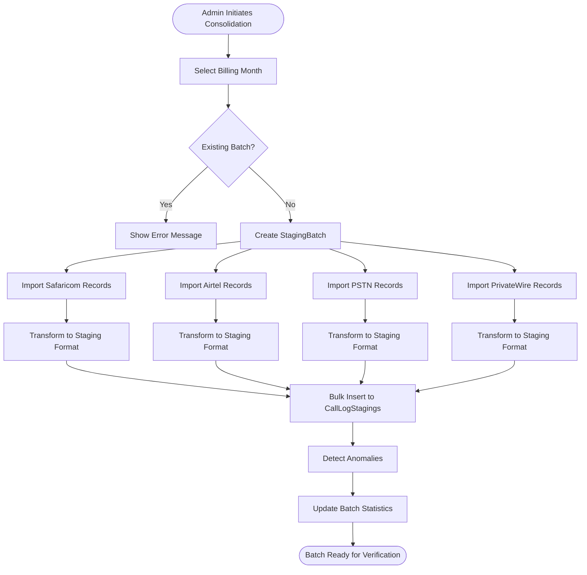

# How Data Moves to CallLogStagings Table

## Overview
Data flows into the `CallLogStagings` table through a **manual consolidation process** triggered by administrators. The system pulls data from 4 source tables and transforms it into a standardized format for verification.

## Data Flow Process



## Step-by-Step Process

### 1. **Initiation (Admin UI)**
- Admin navigates to `/Admin/CallLogStaging`
- Clicks "Consolidate Call Logs" button
- Selects billing month (e.g., "September 2024")

### 2. **Validation Phase**
```csharp
// Check for existing batch
var existingBatch = await GetExistingBatchForPeriodAsync(month, year);
if (existingBatch != null) {
    throw new InvalidOperationException("Batch already exists");
}

// Check if source data exists
if (!HasRecordsToConsolidate) {
    throw new InvalidOperationException("No records found");
}
```

### 3. **Batch Creation**
```csharp
var batch = new StagingBatch {
    Id = Guid.NewGuid(),
    BatchName = $"Call Logs {startDate:MMMM yyyy}",
    BatchType = "Manual",
    BatchStatus = BatchStatus.Created,
    CreatedBy = userName,
    SourceSystems = "Safaricom,Airtel,PSTN,PrivateWire"
};
```

### 4. **Data Import Process**

#### A. **Import from Safaricom**
```csharp
public async Task<int> ImportFromSafaricomAsync(Guid batchId, DateTime startDate, DateTime endDate)
{
    // 1. Query source records
    var records = await _context.Safaricoms
        .Where(s => s.CallMonth == month && s.CallYear == year)
        .ToListAsync();

    // 2. Get UserPhones for mapping
    var userPhones = await _context.UserPhones
        .Where(up => up.IsActive)
        .ToListAsync();

    // 3. Transform each record
    foreach (var r in records) {
        var userPhone = userPhones.FirstOrDefault(up =>
            up.PhoneNumber == r.Ext);

        var stagingRecord = new CallLogStaging {
            ExtensionNumber = r.Ext,
            CallDate = r.CallDate,
            CallNumber = r.Dialed,
            CallDestination = r.Dest,
            CallDuration = (int)(r.Dur * 60), // Convert minutes to seconds
            CallCost = r.Cost,
            CallCostUSD = r.Cost / 150m,      // Currency conversion
            CallCostKSHS = r.Cost,
            CallType = r.CallType ?? "Voice",
            CallDestinationType = DetermineDestinationType(r.Dest),
            ResponsibleIndexNumber = userPhone?.IndexNumber ?? r.IndexNumber,
            UserPhoneId = userPhone?.Id,
            SourceSystem = "Safaricom",
            SourceRecordId = r.Id.ToString(),
            BatchId = batchId,
            ImportedBy = "System",
            ImportedDate = DateTime.UtcNow,
            VerificationStatus = VerificationStatus.Pending,
            ProcessingStatus = ProcessingStatus.Staged
        };

        stagingRecords.Add(stagingRecord);
    }

    // 4. Bulk insert
    _context.CallLogStagings.AddRange(stagingRecords);
    await _context.SaveChangesAsync();
}
```

#### B. **Similar Process for Other Providers**
- **Airtel**: Similar transformation, different field mappings
- **PSTN**: Handles KSH amounts, includes carrier field
- **PrivateWire**: USD amounts, internal calls only

### 5. **Data Transformation Details**

| Source Field | Staging Field | Transformation |
|-------------|---------------|----------------|
| Ext/Extension | ExtensionNumber | Direct copy |
| CallDate | CallDate | Date normalization |
| Dialed/DialedNumber | CallNumber | Direct copy |
| Dest/Destination | CallDestination | Direct copy |
| Dur/Duration (minutes) | CallDuration (seconds) | × 60 conversion |
| Cost (varies) | CallCostUSD | Currency conversion |
| CallType | CallType | Default to "Voice" if null |
| IndexNumber | ResponsibleIndexNumber | Link via UserPhones or direct |

### 6. **Anomaly Detection**
After all imports complete:
```csharp
public async Task<int> DetectBatchAnomaliesAsync(Guid batchId)
{
    var logs = await _context.CallLogStagings
        .Where(l => l.BatchId == batchId)
        .ToListAsync();

    foreach (var log in logs) {
        var anomalies = await DetectAnomaliesAsync(log.Id);

        // Anomalies checked:
        // - NO_USER: No user linked
        // - NO_PHONE: Phone not registered
        // - HIGH_COST: Cost > $100
        // - FUTURE_DATE: Call date in future
        // - EXCESSIVE_DURATION: > 4 hours
        // - INACTIVE_USER: User deactivated

        if (anomalies.Any()) {
            log.HasAnomalies = true;
            log.AnomalyTypes = JsonSerializer.Serialize(anomalies);

            if (anomalies.Any(a => a.Severity == "Critical")) {
                log.VerificationStatus = VerificationStatus.Rejected;
            }
        }
    }
}
```

### 7. **Batch Statistics Update**
```csharp
batch.TotalRecords = totalImported;
batch.RecordsWithAnomalies = anomalyCount;
batch.PendingRecords = totalImported;
batch.BatchStatus = BatchStatus.Processing;
batch.EndProcessingDate = DateTime.UtcNow;
```

## Key Components

### CallLogStagingService Methods
- `ConsolidateCallLogsAsync()` - Main orchestrator
- `ImportFromSafaricomAsync()` - Safaricom import
- `ImportFromAirtelAsync()` - Airtel import
- `ImportFromPSTNAsync()` - PSTN import
- `ImportFromPrivateWireAsync()` - PrivateWire import
- `DetectBatchAnomaliesAsync()` - Quality checks
- `DetermineDestinationType()` - Categorizes calls

### Data Volume Example
Typical monthly consolidation:
```
Safaricom:    1,250 records
Airtel:         830 records
PSTN:           420 records
PrivateWire:     95 records
----------------------------
Total:        2,595 records

Anomalies detected: ~19 records
Processing time: ~3-5 seconds
```

## Manual vs Automated Import

### Current: Manual Process
- Admin manually triggers consolidation
- Select specific billing month
- One-time batch creation
- Immediate processing

### Future: Automated Options
```yaml
Planned enhancements:
- Azure Data Factory integration
- Scheduled monthly imports
- API-based real-time ingestion
- File upload capability
```

## Error Handling

### Common Errors and Solutions

| Error | Cause | Solution |
|-------|-------|----------|
| "Batch already exists" | Duplicate consolidation attempt | Complete or delete existing batch |
| "No records found" | Empty source tables | Ensure data imported to source tables first |
| "User not found" | Invalid IndexNumber | Update user mappings |
| "Processing failed" | Database error | Check logs, retry consolidation |

## SQL Behind the Scenes

### Insert Pattern
```sql
INSERT INTO CallLogStagings (
    ExtensionNumber, CallDate, CallNumber, CallDestination,
    CallDuration, CallCostUSD, CallCostKSHS,
    ResponsibleIndexNumber, UserPhoneId,
    SourceSystem, SourceRecordId, BatchId,
    ImportedBy, ImportedDate,
    VerificationStatus, ProcessingStatus
) VALUES
    (@ExtensionNumber, @CallDate, @CallNumber, @CallDestination,
     @CallDuration, @CallCostUSD, @CallCostKSHS,
     @ResponsibleIndexNumber, @UserPhoneId,
     @SourceSystem, @SourceRecordId, @BatchId,
     @ImportedBy, GETUTCDATE(),
     'Pending', 'Staged')
```

### Query Pattern for Import
```sql
-- Example: Get Safaricom records for September 2024
SELECT * FROM Safaricom
WHERE CallMonth = 9 AND CallYear = 2024
AND ProcessingStatus IN ('Staged', 'Failed')
```

## Performance Considerations

### Bulk Operations
- Uses `AddRange()` for bulk inserts
- Processes ~500-1000 records per second
- Single transaction per provider

### Memory Usage
- Loads all source records into memory
- Transforms in-memory before insert
- ~10MB for 5,000 records

### Optimization Tips
1. Index source tables on CallMonth/CallYear
2. Archive old staging records
3. Run during off-peak hours
4. Monitor batch sizes

## Summary

The CallLogStagings table is populated through a **controlled, manual consolidation process** that:

1. **Pulls** data from 4 source tables (Safaricom, Airtel, PSTN, PrivateWire)
2. **Transforms** heterogeneous formats into standardized schema
3. **Enriches** with user and phone mappings
4. **Detects** anomalies automatically
5. **Groups** records in batches for management
6. **Prepares** for manual verification workflow

This staging approach ensures data quality, provides audit trails, and allows administrators to review and approve telecom charges before they impact billing.