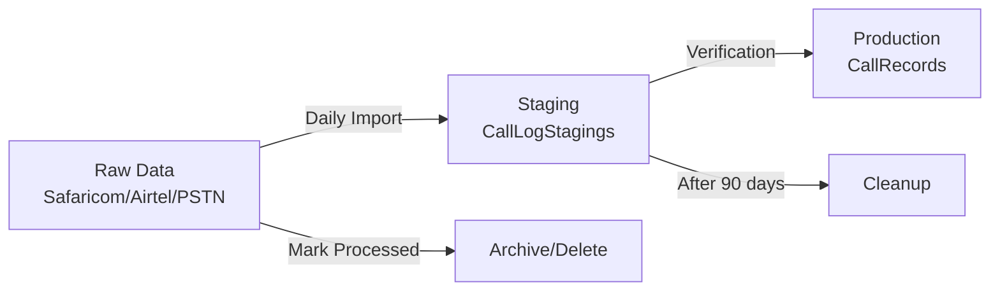

# Call Log Data Lifecycle Strategy

## Overview
This document outlines how call data flows through the system and when/how it should be cleaned up.

## Data Flow Stages



## Recommended Approach: Soft Delete with Processing Flags

### 1. Add Processing Status to Source Tables

```sql
-- Add ProcessingStatus columns to source tables
ALTER TABLE Safaricom ADD
    ProcessingStatus INT DEFAULT 0,  -- 0=New, 1=Staged, 2=Processed, 3=Archived
    ProcessedDate DATETIME NULL,
    BatchId UNIQUEIDENTIFIER NULL;

ALTER TABLE Airtel ADD
    ProcessingStatus INT DEFAULT 0,
    ProcessedDate DATETIME NULL,
    BatchId UNIQUEIDENTIFIER NULL;

ALTER TABLE PSTNs ADD
    ProcessingStatus INT DEFAULT 0,
    ProcessedDate DATETIME NULL,
    BatchId UNIQUEIDENTIFIER NULL;

ALTER TABLE PrivateWires ADD
    ProcessingStatus INT DEFAULT 0,
    ProcessedDate DATETIME NULL,
    BatchId UNIQUEIDENTIFIER NULL;
```

### 2. Processing Workflow

#### Step 1: Import to Staging
When consolidating:
```csharp
// In CallLogStagingService.cs
public async Task<int> ImportFromSafaricomAsync(Guid batchId, DateTime startDate, DateTime endDate)
{
    // Get unprocessed records
    var records = await _context.Safaricoms
        .Where(s => s.ProcessingStatus == 0)  // Only new records
        .Where(s => s.CallDate >= startDate && s.CallDate <= endDate)
        .ToListAsync();

    // Import to staging...

    // Mark source records as staged
    foreach(var record in records)
    {
        record.ProcessingStatus = 1; // Staged
        record.BatchId = batchId;
    }
    await _context.SaveChangesAsync();
}
```

#### Step 2: After Verification
When pushing to production:
```csharp
public async Task<int> PushToProductionAsync(Guid batchId)
{
    // Push verified records to production...

    // Mark source records as processed
    await _context.Database.ExecuteSqlRawAsync(@"
        UPDATE Safaricom SET ProcessingStatus = 2, ProcessedDate = GETDATE()
        WHERE BatchId = @p0", batchId);

    // Same for other tables...
}
```

### 3. Data Retention Policy

| Table | Retention Period | Action After Period |
|-------|-----------------|---------------------|
| **Source Tables** (Safaricom, Airtel, etc.) | 30 days after processing | Archive or Delete |
| **CallLogStagings** | 90 days | Delete |
| **CallRecords** (Production) | 7 years | Archive to cold storage |

### 4. Automated Cleanup Jobs

#### Daily Cleanup Job (SQL Agent or Hangfire)
```sql
-- Archive processed records older than 30 days
INSERT INTO ArchivedCallLogs
SELECT * FROM Safaricom
WHERE ProcessingStatus = 2
AND ProcessedDate < DATEADD(day, -30, GETDATE());

-- Delete archived records
DELETE FROM Safaricom
WHERE ProcessingStatus = 2
AND ProcessedDate < DATEADD(day, -30, GETDATE());

-- Clean staging table
DELETE FROM CallLogStagings
WHERE CreatedDate < DATEADD(day, -90, GETDATE())
AND ProcessingStatus = 2;
```

## Benefits of This Approach

### ✅ Advantages:
1. **No Data Loss** - Source data remains until verified in production
2. **Audit Trail** - Can track which batch processed each record
3. **Reprocessing** - Can re-import if issues found
4. **No Duplicates** - ProcessingStatus prevents double-processing
5. **Performance** - Old data automatically cleaned up

### ⚠️ Considerations:
1. **Storage** - Keeps data for 30 days (configurable)
2. **Maintenance** - Needs scheduled cleanup jobs
3. **Monitoring** - Should monitor table sizes

## Alternative Approaches

### Option 2: Immediate Delete After Processing
```sql
-- Delete immediately after pushing to production
DELETE FROM Safaricom WHERE BatchId = @BatchId;
```
**Pros:** Saves space
**Cons:** No recovery if issues found

### Option 3: Move to Archive Tables
```sql
-- Move to archive table
INSERT INTO Safaricom_Archive
SELECT * FROM Safaricom WHERE ProcessingStatus = 2;

DELETE FROM Safaricom WHERE ProcessingStatus = 2;
```
**Pros:** Keeps history separate
**Cons:** More tables to manage

## Recommended Implementation Steps

1. **Phase 1**: Add ProcessingStatus columns
2. **Phase 2**: Update import services to use status
3. **Phase 3**: Create cleanup stored procedures
4. **Phase 4**: Schedule automated jobs
5. **Phase 5**: Monitor and adjust retention periods

## Monitoring Queries

```sql
-- Check unprocessed records
SELECT
    'Safaricom' as Source,
    COUNT(*) as UnprocessedCount,
    MIN(CreatedDate) as OldestRecord
FROM Safaricom
WHERE ProcessingStatus = 0

UNION ALL

SELECT 'Airtel', COUNT(*), MIN(CreatedDate)
FROM Airtel
WHERE ProcessingStatus = 0;

-- Check table sizes
SELECT
    t.name AS TableName,
    p.rows AS RowCount,
    SUM(a.total_pages) * 8 AS TotalSpaceKB
FROM sys.tables t
INNER JOIN sys.partitions p ON t.object_id = p.object_id
INNER JOIN sys.allocation_units a ON p.partition_id = a.container_id
WHERE t.name IN ('Safaricom', 'Airtel', 'PSTNs', 'PrivateWires')
GROUP BY t.name, p.rows;
```