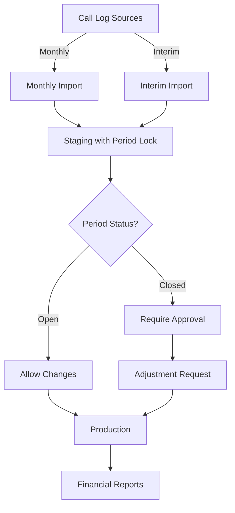

# Monthly vs Interim Call Logs Management Design

## Overview

Enterprise billing systems need to handle two types of call log imports:

1. **Monthly Billing Cycles** - Regular end-of-month processing
2. **Interim Updates** - Mid-month corrections, disputes, or late-arriving data

## Problem Statement

- Telecom providers send monthly bills on schedule (e.g., 5th of each month)
- Sometimes corrections arrive mid-month (disputed charges, missed calls, adjustments)
- Need to track which calls belong to which billing period
- Must prevent duplicate charges while allowing corrections
- Need audit trail for financial compliance

## Solution Architecture



## Database Design

### 1. New Tables

```sql
-- ================================================================
-- BILLING PERIODS TABLE
-- ================================================================
CREATE TABLE BillingPeriods (
    Id INT IDENTITY(1,1) PRIMARY KEY,
    PeriodCode NVARCHAR(20) NOT NULL UNIQUE, -- '2024-09'
    StartDate DATETIME NOT NULL,
    EndDate DATETIME NOT NULL,
    Status NVARCHAR(20) NOT NULL, -- 'OPEN', 'PROCESSING', 'CLOSED', 'LOCKED'

    -- Monthly billing info
    MonthlyImportDate DATETIME NULL,
    MonthlyBatchId UNIQUEIDENTIFIER NULL,
    MonthlyRecordCount INT DEFAULT 0,
    MonthlyTotalCost DECIMAL(18,2) DEFAULT 0,

    -- Interim updates tracking
    InterimUpdateCount INT DEFAULT 0,
    LastInterimDate DATETIME NULL,
    InterimRecordCount INT DEFAULT 0,
    InterimAdjustmentAmount DECIMAL(18,2) DEFAULT 0,

    -- Closure info
    ClosedDate DATETIME NULL,
    ClosedBy NVARCHAR(100) NULL,
    LockedDate DATETIME NULL, -- After this, no changes without CFO approval

    -- Audit
    CreatedDate DATETIME DEFAULT GETDATE(),
    CreatedBy NVARCHAR(100),
    Notes NVARCHAR(MAX)
);

-- ================================================================
-- INTERIM UPDATES TABLE
-- ================================================================
CREATE TABLE InterimUpdates (
    Id INT IDENTITY(1,1) PRIMARY KEY,
    BillingPeriodId INT FOREIGN KEY REFERENCES BillingPeriods(Id),
    UpdateType NVARCHAR(50), -- 'CORRECTION', 'DISPUTE', 'LATE_ARRIVAL', 'ADJUSTMENT'
    BatchId UNIQUEIDENTIFIER NOT NULL,

    -- What changed
    RecordsAdded INT DEFAULT 0,
    RecordsModified INT DEFAULT 0,
    RecordsDeleted INT DEFAULT 0,
    NetAdjustmentAmount DECIMAL(18,2),

    -- Approval workflow
    RequestedBy NVARCHAR(100),
    RequestedDate DATETIME,
    ApprovedBy NVARCHAR(100) NULL,
    ApprovalDate DATETIME NULL,
    ApprovalStatus NVARCHAR(20), -- 'PENDING', 'APPROVED', 'REJECTED'

    -- Documentation
    Justification NVARCHAR(MAX),
    SupportingDocuments NVARCHAR(MAX), -- JSON array of file paths

    -- Processing
    ProcessedDate DATETIME NULL,
    ProcessingNotes NVARCHAR(MAX)
);

-- ================================================================
-- CALL LOG RECONCILIATION TABLE
-- ================================================================
CREATE TABLE CallLogReconciliation (
    Id INT IDENTITY(1,1) PRIMARY KEY,
    BillingPeriodId INT FOREIGN KEY REFERENCES BillingPeriods(Id),
    SourceRecordId INT, -- Original record ID from source table
    SourceTable NVARCHAR(50), -- 'Safaricom', 'Airtel', etc.

    -- Version tracking
    Version INT DEFAULT 1,
    ImportType NVARCHAR(20), -- 'MONTHLY', 'INTERIM'
    ImportBatchId UNIQUEIDENTIFIER,
    ImportDate DATETIME,

    -- Change tracking
    PreviousAmount DECIMAL(18,2) NULL,
    CurrentAmount DECIMAL(18,2),
    AdjustmentReason NVARCHAR(500),

    IsSuperseded BIT DEFAULT 0, -- True if newer version exists
    SupersededBy INT NULL, -- ID of newer version

    INDEX IX_Reconciliation_Period_Source (BillingPeriodId, SourceTable, SourceRecordId)
);
```

### 2. Modified Tables

```sql
-- Add to existing staging tables
ALTER TABLE CallLogStagings ADD
    BillingPeriodId INT NULL,
    ImportType NVARCHAR(20) DEFAULT 'MONTHLY', -- 'MONTHLY', 'INTERIM'
    IsAdjustment BIT DEFAULT 0,
    OriginalRecordId INT NULL, -- Links to record being adjusted
    AdjustmentReason NVARCHAR(500) NULL;

ALTER TABLE StagingBatches ADD
    BillingPeriodId INT NULL,
    BatchCategory NVARCHAR(20) DEFAULT 'MONTHLY'; -- 'MONTHLY', 'INTERIM', 'CORRECTION'

-- Add to source tables
ALTER TABLE Safaricom ADD BillingPeriod NVARCHAR(20) NULL;
ALTER TABLE Airtel ADD BillingPeriod NVARCHAR(20) NULL;
ALTER TABLE PSTNs ADD BillingPeriod NVARCHAR(20) NULL;
ALTER TABLE PrivateWires ADD BillingPeriod NVARCHAR(20) NULL;
```

## Business Logic Implementation

### 1. Billing Period Service

```csharp
public interface IBillingPeriodService
{
    Task<BillingPeriod> GetCurrentPeriodAsync();
    Task<BillingPeriod> GetOrCreatePeriodAsync(DateTime date);
    Task<bool> CanImportInterimAsync(int periodId);
    Task<BillingPeriod> ClosePeriodAsync(int periodId, string closedBy);
    Task<InterimUpdate> RequestInterimUpdateAsync(InterimUpdateRequest request);
}

public class BillingPeriodService : IBillingPeriodService
{
    private readonly ApplicationDbContext _context;
    private readonly ILogger<BillingPeriodService> _logger;

    public async Task<BillingPeriod> GetCurrentPeriodAsync()
    {
        var today = DateTime.Today;
        return await GetOrCreatePeriodAsync(today);
    }

    public async Task<BillingPeriod> GetOrCreatePeriodAsync(DateTime date)
    {
        var periodCode = date.ToString("yyyy-MM");

        var period = await _context.BillingPeriods
            .FirstOrDefaultAsync(p => p.PeriodCode == periodCode);

        if (period == null)
        {
            period = new BillingPeriod
            {
                PeriodCode = periodCode,
                StartDate = new DateTime(date.Year, date.Month, 1),
                EndDate = new DateTime(date.Year, date.Month, 1).AddMonths(1).AddDays(-1),
                Status = "OPEN",
                CreatedDate = DateTime.UtcNow,
                CreatedBy = "System"
            };

            _context.BillingPeriods.Add(period);
            await _context.SaveChangesAsync();

            _logger.LogInformation("Created new billing period: {PeriodCode}", periodCode);
        }

        return period;
    }

    public async Task<bool> CanImportInterimAsync(int periodId)
    {
        var period = await _context.BillingPeriods.FindAsync(periodId);

        if (period == null)
            return false;

        // Allow interim updates for OPEN and PROCESSING periods
        // CLOSED periods require approval
        // LOCKED periods cannot be changed
        return period.Status == "OPEN" || period.Status == "PROCESSING";
    }

    public async Task<InterimUpdate> RequestInterimUpdateAsync(InterimUpdateRequest request)
    {
        var period = await _context.BillingPeriods.FindAsync(request.BillingPeriodId);

        if (period == null)
            throw new InvalidOperationException("Billing period not found");

        var interimUpdate = new InterimUpdate
        {
            BillingPeriodId = request.BillingPeriodId,
            UpdateType = request.UpdateType,
            BatchId = Guid.NewGuid(),
            RequestedBy = request.RequestedBy,
            RequestedDate = DateTime.UtcNow,
            Justification = request.Justification,
            ApprovalStatus = period.Status == "CLOSED" ? "PENDING" : "APPROVED"
        };

        // Auto-approve for open periods
        if (period.Status == "OPEN" || period.Status == "PROCESSING")
        {
            interimUpdate.ApprovedBy = "AUTO";
            interimUpdate.ApprovalDate = DateTime.UtcNow;
        }

        _context.InterimUpdates.Add(interimUpdate);

        // Update period statistics
        period.InterimUpdateCount++;
        period.LastInterimDate = DateTime.UtcNow;

        await _context.SaveChangesAsync();

        // Send notification if approval needed
        if (interimUpdate.ApprovalStatus == "PENDING")
        {
            await SendApprovalRequestAsync(interimUpdate);
        }

        return interimUpdate;
    }
}
```

### 2. Enhanced Call Log Staging Service

```csharp
public class EnhancedCallLogStagingService : ICallLogStagingService
{
    private readonly IBillingPeriodService _billingPeriodService;

    public async Task<StagingBatch> ConsolidateCallLogsAsync(
        DateTime startDate,
        DateTime endDate,
        string createdBy,
        ImportType importType = ImportType.Monthly)
    {
        // Determine billing period
        var billingPeriod = await _billingPeriodService.GetOrCreatePeriodAsync(startDate);

        // Check if interim import is allowed
        if (importType == ImportType.Interim)
        {
            if (!await _billingPeriodService.CanImportInterimAsync(billingPeriod.Id))
            {
                throw new InvalidOperationException(
                    $"Interim updates not allowed for {billingPeriod.Status} period. Request approval first.");
            }
        }

        // Create batch with billing period reference
        var batch = new StagingBatch
        {
            Id = Guid.NewGuid(),
            BatchName = $"{importType} Import - {billingPeriod.PeriodCode}",
            BatchType = importType.ToString(),
            BatchCategory = importType.ToString().ToUpper(),
            BillingPeriodId = billingPeriod.Id,
            CreatedBy = createdBy,
            CreatedDate = DateTime.UtcNow,
            BatchStatus = BatchStatus.Created
        };

        _context.StagingBatches.Add(batch);
        await _context.SaveChangesAsync();

        // Import with duplicate detection
        if (importType == ImportType.Interim)
        {
            await ImportInterimUpdatesAsync(batch.Id, billingPeriod.Id, startDate, endDate);
        }
        else
        {
            await ImportMonthlyBillingAsync(batch.Id, billingPeriod.Id, startDate, endDate);
        }

        return batch;
    }

    private async Task ImportInterimUpdatesAsync(
        Guid batchId,
        int billingPeriodId,
        DateTime startDate,
        DateTime endDate)
    {
        // Get records that haven't been imported for this period
        var existingRecords = await _context.CallLogReconciliations
            .Where(r => r.BillingPeriodId == billingPeriodId)
            .Where(r => !r.IsSuperseded)
            .Select(r => new { r.SourceTable, r.SourceRecordId })
            .ToListAsync();

        // Import only new or updated records
        var safaricomRecords = await _context.Safaricoms
            .Where(s => s.CallDate >= startDate && s.CallDate <= endDate)
            .Where(s => s.BillingPeriod == null ||
                       !existingRecords.Any(e => e.SourceTable == "Safaricom" &&
                                                 e.SourceRecordId == s.Id))
            .ToListAsync();

        foreach (var record in safaricomRecords)
        {
            // Check if this is an update to existing record
            var existingStaging = await _context.CallLogStagings
                .FirstOrDefaultAsync(c => c.SourceSystem == "Safaricom" &&
                                         c.SourceRecordId == record.Id.ToString() &&
                                         c.BillingPeriodId == billingPeriodId);

            if (existingStaging != null)
            {
                // This is an adjustment
                await CreateAdjustmentRecordAsync(existingStaging, record, batchId);
            }
            else
            {
                // New record
                await CreateStagingRecordAsync(record, batchId, billingPeriodId, ImportType.Interim);
            }

            // Mark source record with billing period
            record.BillingPeriod = await GetPeriodCodeAsync(billingPeriodId);
        }

        await _context.SaveChangesAsync();
    }

    private async Task CreateAdjustmentRecordAsync(
        CallLogStaging existing,
        Safaricom updated,
        Guid batchId)
    {
        // Create reconciliation record
        var reconciliation = new CallLogReconciliation
        {
            BillingPeriodId = existing.BillingPeriodId.Value,
            SourceRecordId = updated.Id,
            SourceTable = "Safaricom",
            Version = 2, // Increment version
            ImportType = "INTERIM",
            ImportBatchId = batchId,
            ImportDate = DateTime.UtcNow,
            PreviousAmount = existing.CallCost,
            CurrentAmount = updated.Cost ?? 0,
            AdjustmentReason = "Interim update"
        };

        _context.CallLogReconciliations.Add(reconciliation);

        // Create adjustment staging record
        var adjustment = new CallLogStaging
        {
            // Copy all fields from updated record...
            BillingPeriodId = existing.BillingPeriodId,
            ImportType = "INTERIM",
            IsAdjustment = true,
            OriginalRecordId = existing.Id,
            AdjustmentReason = "Carrier adjustment",
            BatchId = batchId
        };

        _context.CallLogStagings.Add(adjustment);
    }
}
```

### 3. Period Closure Process

```csharp
public class PeriodClosureService
{
    public async Task<ClosureResult> CloseMonthlyPeriodAsync(string periodCode)
    {
        var period = await _context.BillingPeriods
            .FirstOrDefaultAsync(p => p.PeriodCode == periodCode);

        if (period == null)
            throw new InvalidOperationException($"Period {periodCode} not found");

        if (period.Status == "LOCKED")
            throw new InvalidOperationException("Period is already locked");

        var result = new ClosureResult { PeriodCode = periodCode };

        using (var transaction = await _context.Database.BeginTransactionAsync())
        {
            try
            {
                // 1. Verify all staging records are processed
                var unprocessedCount = await _context.CallLogStagings
                    .CountAsync(c => c.BillingPeriodId == period.Id &&
                                    c.VerificationStatus == VerificationStatus.Pending);

                if (unprocessedCount > 0)
                {
                    result.Warnings.Add($"{unprocessedCount} unprocessed staging records");
                }

                // 2. Calculate final totals
                var totals = await _context.CallRecords
                    .Where(c => c.CallMonth == period.StartDate.Month &&
                               c.CallYear == period.StartDate.Year)
                    .GroupBy(c => 1)
                    .Select(g => new
                    {
                        TotalRecords = g.Count(),
                        TotalCost = g.Sum(c => c.CallCostUSD)
                    })
                    .FirstOrDefaultAsync();

                // 3. Update period with final numbers
                period.Status = "CLOSED";
                period.ClosedDate = DateTime.UtcNow;
                period.ClosedBy = _currentUser.Name;
                period.MonthlyRecordCount = totals?.TotalRecords ?? 0;
                period.MonthlyTotalCost = totals?.TotalCost ?? 0;

                // 4. Generate closure report
                result.TotalRecords = period.MonthlyRecordCount;
                result.TotalAmount = period.MonthlyTotalCost;
                result.InterimAdjustments = period.InterimAdjustmentAmount;
                result.FinalAmount = period.MonthlyTotalCost + period.InterimAdjustmentAmount;

                // 5. Archive staging data
                await ArchiveStagingDataAsync(period.Id);

                await _context.SaveChangesAsync();
                await transaction.CommitAsync();

                // 6. Send notifications
                await NotifyPeriodClosureAsync(period, result);

                return result;
            }
            catch (Exception ex)
            {
                await transaction.RollbackAsync();
                throw;
            }
        }
    }

    public async Task<bool> ReopenPeriodAsync(int periodId, string reason)
    {
        var period = await _context.BillingPeriods.FindAsync(periodId);

        if (period.Status == "LOCKED")
        {
            // Requires special approval
            var approval = await RequestReopenApprovalAsync(periodId, reason);
            if (!approval.IsApproved)
                return false;
        }

        period.Status = "PROCESSING";
        period.Notes += $"\nReopened on {DateTime.UtcNow} by {_currentUser.Name}: {reason}";

        await _context.SaveChangesAsync();
        return true;
    }
}
```

## UI Components

### Admin Dashboard for Period Management

```html
<!-- BillingPeriods.cshtml -->
@page
@model BillingPeriodsModel

<div class="billing-periods-dashboard">
    <div class="period-summary">
        <h3>Current Period: @Model.CurrentPeriod.PeriodCode</h3>
        <span class="badge @Model.GetStatusClass()">@Model.CurrentPeriod.Status</span>
    </div>

    <div class="period-actions">
        @if (Model.CurrentPeriod.Status == "OPEN")
        {
            <button onclick="importMonthly()" class="btn btn-primary">
                Import Monthly Billing
            </button>
            <button onclick="importInterim()" class="btn btn-secondary">
                Import Interim Updates
            </button>
        }
        else if (Model.CurrentPeriod.Status == "PROCESSING")
        {
            <button onclick="closePeriod()" class="btn btn-warning">
                Close Period
            </button>
        }
        else if (Model.CurrentPeriod.Status == "CLOSED")
        {
            <button onclick="requestReopening()" class="btn btn-danger">
                Request Reopening
            </button>
        }
    </div>

    <div class="period-statistics">
        <div class="stat-card">
            <h4>Monthly Import</h4>
            <p>Records: @Model.CurrentPeriod.MonthlyRecordCount</p>
            <p>Total: $@Model.CurrentPeriod.MonthlyTotalCost</p>
        </div>
        <div class="stat-card">
            <h4>Interim Updates</h4>
            <p>Count: @Model.CurrentPeriod.InterimUpdateCount</p>
            <p>Adjustment: $@Model.CurrentPeriod.InterimAdjustmentAmount</p>
        </div>
    </div>

    @if (Model.PendingInterimUpdates.Any())
    {
        <div class="pending-approvals alert alert-warning">
            <h4>Pending Interim Update Approvals</h4>
            @foreach (var update in Model.PendingInterimUpdates)
            {
                <div class="approval-item">
                    <span>@update.UpdateType - @update.Justification</span>
                    <button onclick="approveInterim(@update.Id)" class="btn btn-sm btn-success">
                        Approve
                    </button>
                    <button onclick="rejectInterim(@update.Id)" class="btn btn-sm btn-danger">
                        Reject
                    </button>
                </div>
            }
        </div>
    }
</div>
```

## Key Benefits

1. **Clear Separation** - Monthly vs Interim imports are tracked separately
2. **Audit Trail** - Complete history of all changes and adjustments
3. **Approval Workflow** - Closed periods require approval for changes
4. **Reconciliation** - Can track multiple versions of the same call record
5. **Financial Controls** - Period locking prevents unauthorized changes
6. **Flexibility** - Supports corrections and disputes while maintaining integrity

## Workflow Examples

### Monthly Import (5th of each month)
1. Automated job triggers on 5th
2. Creates/uses billing period for previous month
3. Imports all call records
4. Marks period as "PROCESSING"
5. Finance team reviews
6. Period closed by 10th

### Interim Update (Dispute Resolution)
1. Customer disputes charge on 15th
2. Admin requests interim update
3. If period is closed, approval required
4. Once approved, adjustment imported
5. Reconciliation tracks both versions
6. Reports show original + adjustments

### Year-End Audit
1. All periods must be LOCKED
2. Generate reconciliation reports
3. Show all adjustments with justifications
4. Export to financial system
5. Archive after audit complete